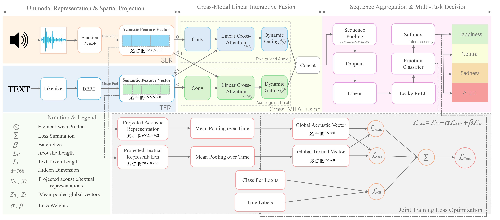

# Cross-MILA

Official implementation of **Cross-MILA: Locality-Aware Linear Cross-Modal
Interaction for Audio-Text Emotion Recognition**.

Cross-MILA combines HuBERT and BERT representations through two reciprocal
audio-text interaction branches. Each branch enriches the target-side query
with depth-wise temporal convolution, applies associative linear
cross-attention, and modulates the retrieved response with a learned dynamic
gate. The complete training objective combines cross-entropy, paired RBF
alignment (PRA), and representation decorrelation.



## Main Results

Results use speaker/session-independent five-fold protocols for IEMOCAP and
the English subset of ESD. Values below are five-fold means.

| Dataset | Model | WA | UA | Macro-F1 | Weighted-F1 |
|---|---|---:|---:|---:|---:|
| IEMOCAP | Reproduced MemoCMT | 69.56 | 70.89 | 70.23 | 69.48 |
| IEMOCAP | Cross-MILA | **74.49** | **74.80** | **74.90** | **74.45** |
| ESD | Reproduced MemoCMT | 74.51 | 74.47 | 74.29 | 74.54 |
| ESD | Cross-MILA | **79.73** | **79.87** | **79.65** | **79.75** |

Fold-level measurements, controlled ablations, unimodal baselines, MELD
results, and efficiency measurements are versioned in [`results/`](results/).

## Repository Layout

```text
assets/                 Architecture and paper figures
data/                   Expected local data layout (data are not committed)
docs/                   Reproduction and release notes
results/                Versioned CSV results used by the manuscript
scripts/                Preprocessing, fold construction, training, evaluation
src/                    Models, objectives, data loaders, and trainer
```

## Installation

Python 3.10 or 3.11 is recommended. Install a PyTorch/torchaudio build that
matches the local CUDA runtime first; then install the remaining dependencies.

```bash
python -m venv .venv
# Linux/macOS: source .venv/bin/activate
# Windows PowerShell: .venv\Scripts\Activate.ps1
pip install torch torchaudio --index-url https://download.pytorch.org/whl/cu128
pip install -r requirements.txt
```

The final HuBERT system does **not** depend on FunASR, ModelScope, PEFT, or
emotion2vec.

## Data Preparation

Datasets are not redistributed. Prepare MemoCMT-style PKL files first, then
construct the five folds used in the paper:

```bash
python scripts/build_speaker_independent_folds.py \
  --dataset IEMOCAP \
  --source /path/to/IEMOCAP_preprocessed \
  --output data/processed/IEMOCAP \
  --mode paper_like --seed 0

python scripts/build_speaker_independent_folds.py \
  --dataset ESD \
  --source /path/to/ESD_preprocessed \
  --output data/processed/ESD \
  --mode paper_like --seed 0
```

`paper_like` holds out one IEMOCAP session or one ESD speaker pair for testing
and forms a stratified validation subset from the remaining development pool.
Each generated fold contains `train.pkl`, `val.pkl`, `test.pkl`,
`classes.json`, and `manifest.json`. See [`data/README.md`](data/README.md) for
the expected structure.

## Training

All machine-specific paths are supplied through environment variables. The
default model is the full HuBERT-BERT Cross-MILA model, so the command below
cannot silently fall back to a unimodal variant.

### Windows PowerShell

```powershell
$env:DATASET_NAME = "IEMOCAP"
$env:IEMOCAP_FOLD = "1"
$env:IEMOCAP_5FOLD_ROOT = "D:\data\IEMOCAP_5fold"
$env:CROSS_MILA_OUTPUT_ROOT = "D:\experiments\Cross-MILA"
$env:TRAINING_STAGE = "stage1"
python scripts/train.py

$env:TRAINING_STAGE = "stage2"
$env:STAGE2_FINETUNE_PATH = "D:\experiments\Cross-MILA\...\weights\best_acc\checkpoint_0.pth"
python scripts/train.py
```

### Linux/macOS

```bash
export DATASET_NAME=IEMOCAP IEMOCAP_FOLD=1
export IEMOCAP_5FOLD_ROOT=/data/IEMOCAP_5fold
export CROSS_MILA_OUTPUT_ROOT=/experiments/Cross-MILA
export TRAINING_STAGE=stage1
python scripts/train.py

export TRAINING_STAGE=stage2
export STAGE2_FINETUNE_PATH=/experiments/Cross-MILA/.../weights/best_acc/checkpoint_0.pth
python scripts/train.py
```

Repeat with folds `1` to `5`. Use `DATASET_NAME=ESD` and `ESD_FOLD`; MELD uses
`DATASET_NAME=MELD` and `MELD_ROOT` with the official train/dev/test split.

Important optional overrides are `MODEL_VARIANT`, `POOLING_STRATEGY`,
`ALPHA_PRA`, `BETA_DEC`, `PRA_SIGMA`, `NUM_EPOCHS`, `BATCH_SIZE`, and
`NUM_WORKERS`. The formal defaults are `MODEL_VARIANT=cross_mila`,
`ALPHA_PRA=0.1`, `BETA_DEC=0.05`, and `PRA_SIGMA=1.0`.

By default, training keeps only the validation-best model weights. For a
resumable run, set `SAVE_ALL_STATES=1` and `SAVE_EACH_EPOCH=1`; resume it with
`RESUME=1` and `RESUME_PATH=/path/to/checkpoint_<epoch>_<step>.pt`. Full-state
checkpoints are local artifacts and should not be committed to Git.

## Evaluation

```bash
python scripts/eval.py \
  -ckpt /path/to/run \
  --checkpoint_file /path/to/run/weights/best_acc/checkpoint_0.pth \
  -t test.pkl -cm
```

The evaluator reports BACC/UA, ACC/WA, Macro-F1, Weighted-F1, and an optional
row-normalized confusion matrix.

## Efficiency Benchmark

```bash
python scripts/benchmark_fusion.py --model all --mode inference \
  --precision fp16 --batch_size 1 --audio_len 1024 --text_len 128 \
  --repeat 200 --warmup 50 --runs 5
```

For publication-quality peak-memory values, benchmark one operator per fresh
process. The exact commands and interpretation are documented in
[`docs/REPRODUCIBILITY.md`](docs/REPRODUCIBILITY.md).

## Checkpoints and Large Files

Do not commit datasets or checkpoints to Git. A full checkpoint contains model,
optimizer, scheduler, and AMP states and can be several gigabytes. If public
weights are released, place selected `best_acc` files in GitHub Releases or
Zenodo and publish their SHA-256 checksums and matching `cfg.log` files.

## Terminology and Backward Compatibility

Early internal experiments called the batch-size-one kernel objective `MMD`.
The public code and manuscript use the mathematically precise term **paired
RBF alignment**, with `alpha_pra` and `paired_rbf_loss`. The loader retains a
small migration layer for old `cfg.log` files and checkpoint key names; these
aliases are not part of the new public API.

## License and Attribution

This project is released under the MIT License. It is derived from
[MemoCMT](https://github.com/tpnam0901/MemoCMT); the upstream copyright and
license are retained. See [`NOTICE`](NOTICE) for a concise modification record.
The repository publication checklist is available in
[`docs/PUBLISHING.md`](docs/PUBLISHING.md).
